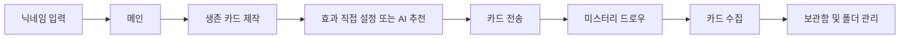

# KUIT Hackathon 2026 Frontend

> 나만의 여름 생존 카드를 만들고, 친구와 교환하며, 미스터리 드로우로 새로운 카드를 수집하는 모바일 웹 서비스

## 프로젝트 소개

KUIT Hackathon 2026 Frontend는 사용자가 자신만의 여름 생존 노하우를 카드로 만들고 다른 사용자와 주고받을 수 있도록 구현한 React 기반 웹 애플리케이션입니다.

카드의 효과와 강도를 직접 설정하거나 AI 추천을 받을 수 있으며, 받은 카드는 보관함과 폴더를 이용해 관리할 수 있습니다. 미스터리 드로우에서는 뒷면으로 놓인 후보 카드 중 하나를 공개하고 선택하는 경험을 제공합니다.

## 주요 기능

| 기능 | 설명 |
| --- | --- |
| 사용자 시작 | 닉네임 중복 확인 및 사용자 생성 |
| 생존 카드 제작 | 제목, 설명, 추천 상황, 난이도와 최대 3개의 효과 설정 |
| AI 효과 추천 | 카드 내용을 기반으로 효과 종류와 1~5단계 강도 추천 |
| 카드 전송 | 생성한 미전송 카드를 메시지와 함께 다른 사용자에게 전송 |
| 미스터리 드로우 | 4개의 후보 중 카드를 공개한 뒤 최종 선택 |
| 카드 보관함 | 수집한 카드 조회, 즐겨찾기, 메모 수정 |
| 폴더 관리 | 사용자 폴더 생성·수정·삭제 및 카드 분류 |

## 사용자 흐름



## 페이지 구성

| 경로 | 화면 | 역할 |
| --- | --- | --- |
| `/` | 로그인 | 닉네임 확인 및 사용자 생성 |
| `/main` | 메인 | 주요 기능 진입 |
| `/write` | 카드 만들기 | 카드 정보와 효과 입력, AI 추천 |
| `/send` | 카드 보내기 | 미전송 카드 선택 및 메시지 작성 |
| `/mystery/:mysteryDrawId` | 미스터리 드로우 | 후보 카드 공개 및 최종 선택 |
| `/received/:id` | 받은 카드 | 선택한 카드 결과 확인 |
| `/storage` | 보관함 | 수집 카드와 폴더 관리 |

## 기술 스택

| 구분 | 기술 |
| --- | --- |
| UI | React 19, TypeScript 6 |
| Routing | React Router DOM 7 |
| Build | Vite 8 |
| Styling | Tailwind CSS 4, CSS |
| Code Quality | ESLint |
| Deployment | Vercel |

## 프로젝트 구조

```text
src/
├── api/          # 도메인별 API 요청 함수
├── assets/       # 애플리케이션 내부 이미지 리소스
├── components/   # 카드, 폴더 선택 등 공통 컴포넌트
├── constants/    # 효과 메타데이터
├── hooks/        # 효과 타입 조회 등 공통 훅
├── pages/        # 라우트 단위 페이지
├── types/        # API 및 도메인 타입
└── utils/        # 색상 변환 등 공통 유틸리티

public/
└── images/       # 카드 프레임, 효과 아이콘, 미스터리 카드 리소스
```

## 핵심 구현

### 카드 효과 설정과 AI 추천

카드에는 `COOLING`, `MENTAL`, `STAMINA`, `WEALTH`, `ENDURANCE` 효과 중 최대 3개를 설정할 수 있습니다. 각 효과는 1~5단계 강도를 가지며, 직접 선택하거나 AI 추천 결과를 적용할 수 있습니다.

- 효과 선택 여부와 강도를 하나의 상태로 관리
- 최대 3개 선택 제한을 UI에서 즉시 검증
- AI 추천 점수를 1~5 범위로 보정한 뒤 동일한 상태 구조에 반영
- 효과 메타데이터와 사용자 입력 상태를 분리해 아이콘·색상·이름을 일관되게 표시
- 현재 상태를 카드 미리보기와 생성 API 요청 데이터에 함께 사용

### 미스터리 드로우

서버에서 받은 4개의 후보 카드를 2×2 형태로 보여주며, 카드 공개와 최종 선택을 두 단계로 분리했습니다.

1. 첫 번째 클릭은 선택한 카드의 뒷면을 효과별 프레임과 정보로 전환합니다.
2. 공개된 같은 카드를 다시 클릭하면 최종 선택 API를 호출합니다.
3. 요청 중에는 추가 클릭을 막아 중복 선택 요청을 방지합니다.
4. 서버가 `selectable=false`로 내려준 후보는 선택할 수 없게 처리합니다.
5. 선택 성공 후 받은 카드 데이터를 결과 페이지로 전달합니다.

## 고민과 해결 과정

### 1. 카드 제작 화면에서 효과 강도를 직관적으로 표시하기

#### 문제

카드 효과는 단순한 선택 항목이 아니라 선택 여부와 1~5단계 강도를 동시에 표현해야 했습니다. 최대 3개라는 제한도 있었고, 사용자가 직접 고친 값과 AI가 추천한 값이 같은 화면에서 충돌 없이 동작해야 했습니다.

효과마다 개별 상태를 따로 두면 다음 문제가 생길 수 있었습니다.

- 선택 상태와 강도 상태가 서로 어긋남
- AI 추천 적용 시 여러 상태를 각각 초기화해야 함
- 미리보기와 API 요청 데이터가 서로 다른 값을 참조할 가능성

#### 해결

효과 상태를 다음과 같이 정규화했습니다.

```ts
type EffectsState = Record<
  EffectId,
  {
    active: boolean;
    level: number;
  }
>;
```

각 효과 행에는 1~5단계 선택 UI를 두고, 현재 단계까지 시각적으로 채워 강도를 한눈에 확인할 수 있게 했습니다. 효과 활성화 시 현재 선택 개수를 검사해 3개를 초과하지 않도록 했고, AI 추천을 적용할 때는 기존 활성 상태를 초기화한 뒤 상위 3개 추천만 활성화했습니다. 추천 점수는 `1~5` 범위로 보정해 예상하지 못한 응답이 UI를 깨뜨리지 않도록 했습니다.

효과의 이름·아이콘·색상 같은 표현 정보는 별도 메타데이터로 관리했습니다. 덕분에 직접 입력과 AI 추천이 같은 상태를 공유하고, 카드 미리보기와 서버 요청 데이터도 하나의 원본에서 안정적으로 생성할 수 있었습니다.

### 2. 미스터리 드로우의 카드 공개 효과 구현하기

#### 문제

미스터리 드로우에서는 처음에 카드 뒷면이 보이고, 사용자가 누르면 카드가 뒤집혀 결과가 나타나는 느낌을 줘야 했습니다. 동시에 한 번의 터치만으로 서버의 최종 선택이 확정되면 실수로 카드를 뽑을 수 있고, 빠르게 여러 번 누르면 선택 요청이 중복될 가능성도 있었습니다.

즉, 화면상의 공개 연출과 서버의 실제 선택을 분리하면서도 사용자가 자연스럽게 이해할 수 있는 흐름이 필요했습니다.

#### 해결

`selectedOptionId`를 카드 공개 상태로 사용해 첫 클릭에서는 API를 호출하지 않고 해당 카드만 공개하도록 했습니다. 공개된 카드를 다시 클릭했을 때만 선택 API를 호출하는 2단계 상호작용을 구성했습니다.

카드 뒷면과 공개 컴포넌트를 조건부 렌더링해 뒤집혀 결과가 나타나는 흐름을 만들고, 공개된 카드의 주요 효과에 맞춰 프레임을 다르게 표시했습니다. 또한 `isSelecting` 상태로 요청 중 모든 후보의 추가 클릭을 막고, 서버가 내려준 `selectable` 값도 버튼 활성 조건에 반영했습니다.

이 구조를 통해 사용자는 카드를 먼저 확인한 뒤 선택을 확정할 수 있고, 프론트엔드는 중복 요청이나 이미 선택이 끝난 후보에 대한 잘못된 요청을 방지할 수 있었습니다.

## API 연동 방식

모든 API 요청은 `/api` 경로를 사용합니다.

- 로컬 개발: Vite 프록시가 `/api` 요청을 백엔드 서버로 전달
- Vercel 배포: `vercel.json`의 rewrite 규칙으로 `/api/:path*` 전달
- 사용자 식별: 로그인 후 `userId`와 `nickname`을 `localStorage`에 저장
- 인증이 필요한 요청: `X-USER-ID` 헤더에 사용자 ID 전달

프록시를 사용하므로 브라우저는 프론트엔드와 같은 출처의 `/api`로 요청하고, 개발·배포 환경의 프록시가 실제 백엔드로 연결합니다.

## 실행 방법

### 요구 사항

- Node.js 20.19 이상 또는 22.12 이상
- npm

### 설치 및 실행

```bash
git clone https://github.com/kms0616/frontend.git
cd frontend
npm install
npm run dev
```

기본 개발 서버는 `http://localhost:5173`에서 실행됩니다.

### 품질 확인

```bash
npm run lint
npm run build
```

### 프로덕션 빌드 미리보기

```bash
npm run preview
```

## 저장소

- Frontend: [github.com/kms0616/frontend](https://github.com/kms0616/frontend)

## 참고 사항

- 현재 인증은 해커톤 MVP에 맞춰 `localStorage`와 `X-USER-ID` 헤더를 사용합니다.
- 모바일 화면을 중심으로 설계된 인터페이스입니다.
- 프론트엔드 단독 실행 시 카드 생성·전송·보관함 기능을 사용하려면 백엔드 API 연결이 필요합니다.
